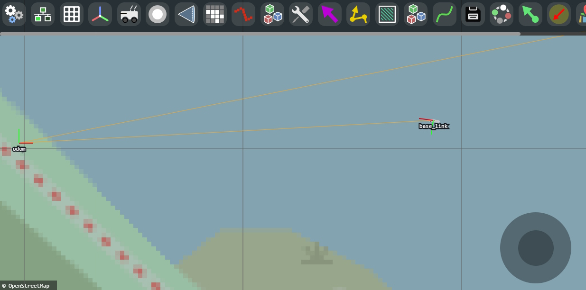

[](https://opensource.org/licenses/MIT)

# About

Tuna is an open-electronics and open-software GNSS platform for ROS, based on the Pi 4. It uses diff drive control for locomotion with [diff_drive_simple](https://github.com/MoffKalast/diff_drive_simple), a standard percision GNSS receiver for absolute localization with [navsat_simple](https://github.com/MoffKalast/navsat_simple), and an IMU for rotational data. If you see the overreaching theme there, I'm trying to keep everything as simple as possible.

In the current iteration it uses [Vizanti](https://github.com/MoffKalast/vizanti) as the mission planner and [line_planner](https://github.com/MoffKalast/line_planner) as its local planner. You can find more specific info below or in the related videos.

List of videos about construction and testing:

| Video      | Description |
| ----------- | ----------- |
| [](https://www.youtube.com/watch?v=CoFgflu3uPA) | Hardware setup and general software stack info, initial testing with ROS Mobile and navsat_transform_node.       |
| [](https://www.youtube.com/watch?v=l3ynv3hPWGs) | Practical navigation experiments with proprietary EZ-Map and gps_common. Simulation in Ignition Gazebo.       |
| [](https://www.youtube.com/watch?v=NZO6q_YMRwI) | Open source navigation and interface with Vizanti, developing the more accurate line_planner. Survey pattern tests. |


# Circuit Diagram


# Node Graph


# Installation

## Running in Gazebo Fortress


Base requirements:
- [ROS Noetic](http://wiki.ros.org/noetic/Installation/Ubuntu)
- [Gazebo Ignition (version Fortress)](https://gazebosim.org/docs/fortress/install_ubuntu)
- [ros_ign bridge for Noetic](https://github.com/gazebosim/ros_gz/tree/noetic#from-source)

Clone repos:

```bash
cd ~/catkin_ws/src
git clone https://github.com/MoffKalast/tuna.git
# Diff drive controller
git clone https://github.com/MoffKalast/diff_drive_simple.git
# Localization fusion
git clone https://github.com/MoffKalast/navsat_simple.git
# Goal planner
git clone https://github.com/MoffKalast/line_planner.git

# Optional, for RViz Viewing
git clone https://github.com/nobleo/rviz_satellite.git

# ign bridge setup, skip if already installed
export IGNITION_VERSION=fortress
git clone https://github.com/osrf/ros_ign.git -b noetic

cd ~/catkin_ws
rosdep install --from-paths src --ignore-src --rosdistro=noetic -y
catkin_make
```

Run:
```bash
# Run the sim
roscd tuna_gazebo
ign gazebo water_world.sdf -r

# Run bridge and navigation nodes
roslaunch tuna_gazebo ign.launch

# Visualize
roslaunch tuna_viz rviz.launch

# Turn on currnent/wind simulation
rosrun tuna_gazebo wave_generator.py

```

<br>

## Running with Vizanti



Install:

```bash
cd ~/catkin_ws/src
https://github.com/MoffKalast/vizanti.git
cd ..
rosdep install --from-paths src --ignore-src --rosdistro=noetic -y
catkin_make
```

Run:
```bash
roslaunch vizanti server.launch
```
Then view http://localhost:5000

<br>

## Running on a Raspberry Pi

Clone hw drivers:
```bash
cd ~/catkin_ws/src
git clone https://github.com/dpkoch/imu_calib.git
git clone https://github.com/MoffKalast/onewiretemp.git
git clone https://github.com/MoffKalast/safety_light.git
git clone https://github.com/MoffKalast/mpu9255.git

cd ~/catkin_ws
rosdep install --from-paths src --ignore-src --rosdistro=noetic -y
catkin_make
```

To run this on a Pi 4, start with a [20.04 Ubuntu Pi image](https://learn.ubiquityrobotics.com/noetic_pi_image_downloads), install everything as listed above, plus [pigpio](https://abyz.me.uk/rpi/pigpio/download.html).

Fix services to set up correct ROS params and autorun at boot:

```bash
cd ~/catkin_ws/src/tuna/tuna_bringup/config_scripts
sudo cp roscore.service /etc/systemd/system/roscore.service

sudo cp magni-base /usr/sbin/magni-base
sudo cp roscore /usr/sbin/roscore

sudo cp env.sh /etc/ubiquity/env.sh
sudo cp ros_setup.bash /etc/ubiquity/ros_setup.bash
sudo cp ros_setup.sh /etc/ubiquity/ros_setup.sh
```

Changes to `/boot/config.txt` for i2c, uart, and LED power saving:

```bash
# disable rainbow splash screen for faster booting
disable_splash=1

# Set up UART and disable BT
dtoverlay=disable-bt
dtoverlay=uart0

# Set up I2C
dtoverlay=i2c-gpio,i2c_gpio_sda=2,i2c_gpio_scl=3,bus=1 core_freq=250

# Disable the PWR LED
dtparam=pwr_led_trigger=none
dtparam=pwr_led_activelow=off

# Disable the Activity LED
dtparam=act_led_trigger=none
dtparam=act_led_activelow=off

# Disable ethernet port LEDs
dtparam=eth_led0=4
dtparam=eth_led1=4
```

### Enable Kernel Interfaces

For the `safety_light` to have the correct kernel interface access create `/etc/udev/rules.d/99-gpio.rules` with the following contents (if it doesn't already exist):

```bash
SUBSYSTEM=="bcm2835-gpiomem", KERNEL=="gpiomem", GROUP="gpio", MODE="0660"
SUBSYSTEM=="gpio", KERNEL=="gpiochip*", ACTION=="add", RUN+="/bin/sh -c 'chown root:gpio /sys/class/gpio/export /sys/class/gpio/unexport ; chmod 220 /sys/class/gpio/export /sys/class/gpio/unexport'"
SUBSYSTEM=="gpio", KERNEL=="gpio*", ACTION=="add", RUN+="/bin/chown root:gpio /sys%p/active_low /sys%p/edge /sys%p/direction /sys%p/value", RUN+="/bin/chmod 660 /sys%p/active_low /sys%p/edge /sys%p/direction /sys%p/value"
```
### Run

This launch file will also launch automatically at boot via the magni-base service.

```bash
roslaunch tuna_bringup core.launch
```
