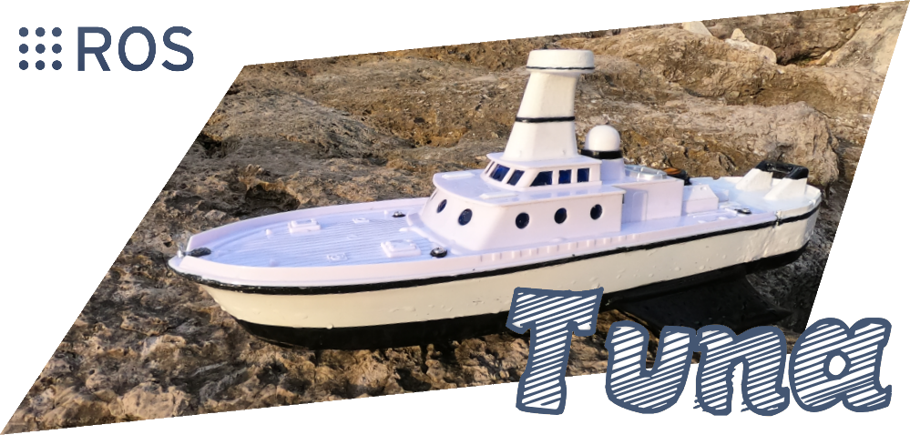
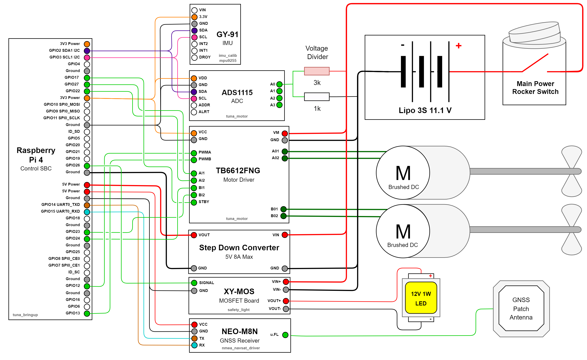
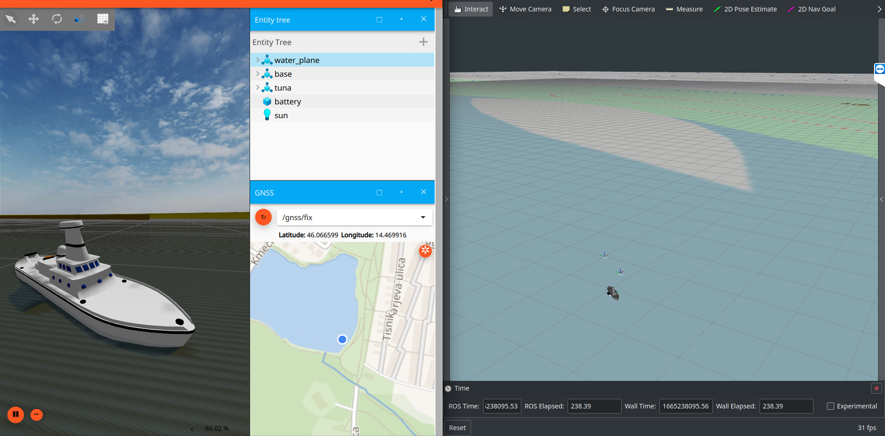

[](https://opensource.org/licenses/MIT)

# About

List of videos about construction and testing:

- ### [Tuna - ROS Autonomous Boat (Part 1)](https://www.youtube.com/watch?v=CoFgflu3uPA)
- ### Tuna - ROS Autonomous Boat (Part 2)

# Circuit Diagram



# Node Graph


# Installation

## Running in Gazebo Fortress



Base requirements:
- [ROS Noetic](http://wiki.ros.org/noetic/Installation/Ubuntu)
- [Gazebo Ignition (version Fortress)](https://gazebosim.org/docs/fortress/install)
- [ros_ign bridge for Noetic](https://github.com/gazebosim/ros_gz/tree/noetic#from-source)

Clone repos:

```
cd ~/catkin_ws/src
git clone https://github.com/MoffKalast/tuna.git
git clone https://github.com/MoffKalast/diff_drive_simple.git

git clone https://github.com/UbiquityRobotics/move_basic.git --branch 0.4.1
git clone https://github.com/nobleo/rviz_satellite.git

// ign bridge setup, skip if already installed
export IGNITION_VERSION=fortress
git clone https://github.com/osrf/ros_ign.git -b noetic

cd ~/catkin_ws
rosdep install --from-paths src --ignore-src --rosdistro=noetic -y
catkin_make
```

Run:
```
// Run the sim
roscd tuna_gazebo
ign gazebo water_world.sdf -r

// Run bridge and Tuna nodes
roslaunch tuna_gazebo ign.launch

// Visualize
roslaunch tuna_viz rviz.launch

```

## Running EZ-Map with Tuna

(Should be open sourced soon, repos are still private)

Install required plugin packages and their deps:

```
pip install pyyaml
sudo apt-get install ros-noetic-rosbridge-suite ros-noetic-tf2-web-republisher python3-smbus ros-noetic-nmea-navsat-driver libudev-dev

cd ~/catkin_ws/src
git clone https://github.com/UbiquityRobotics/move_basic.git --branch 0.4.1

git clone https://github.com/UbiquityRobotics/ezmap_core.git
git clone https://github.com/UbiquityRobotics/ezpkg_battery_widget.git
git clone https://github.com/UbiquityRobotics/ezpkg_map_screen.git
git clone https://github.com/UbiquityRobotics/ezpkg_rosbag_widget.git

cd ~/catkin_ws
rosdep install --from-paths src --ignore-src --rosdistro=noetic -y
catkin_make
```

Run:
```
roslaunch tuna_ezmap ezmap.launch

// then view http://localhost:3000
```


## Running on Raspberry Pi

Clone hw drivers:
```
cd ~/catkin_ws/src
git clone https://github.com/dpkoch/imu_calib.git
git clone https://github.com/MoffKalast/safety_light.git
git clone https://github.com/MoffKalast/mpu9255.git

cd ~/catkin_ws
rosdep install --from-paths src --ignore-src --rosdistro=noetic -y
catkin_make
```

To run this on a Pi 4, start with a [20.04 Ubuntu Pi image](https://learn.ubiquityrobotics.com/noetic_pi_image_downloads), install everything as listed above, plus [pigpio](https://abyz.me.uk/rpi/pigpio/download.html).

Fix services to set up correct ROS params and autorun at boot:

```
cd ~/catkin_ws/src/tuna/tuna_bringup/config_scripts
sudo cp roscore.service /etc/systemd/system/roscore.service

sudo cp magni-base /usr/sbin/magni-base
sudo cp roscore /usr/sbin/roscore

sudo cp env.sh /etc/ubiquity/env.sh
sudo cp ros_setup.bash /etc/ubiquity/ros_setup.bash
sudo cp ros_setup.sh /etc/ubiquity/ros_setup.sh
```

Changes to `/boot/config.txt` for i2c, uart, and LED power saving:

```
# disable rainbow splash screen for faster booting
disable_splash=1

# Set up UART and disable BT
dtoverlay=disable-bt
dtoverlay=uart0

# Set up I2C
dtoverlay=i2c-gpio,i2c_gpio_sda=2,i2c_gpio_scl=3,bus=1 core_freq=250

# Disable the PWR LED
dtparam=pwr_led_trigger=none
dtparam=pwr_led_activelow=off

# Disable the Activity LED
dtparam=act_led_trigger=none
dtparam=act_led_activelow=off

# Disable ethernet port LEDs
dtparam=eth_led0=4
dtparam=eth_led1=4
```

### Enable Kernel Interfaces

For the `safety_light` to have the correct kernel interface access create `/etc/udev/rules.d/99-gpio.rules` with the following contents (if it doesn't already exist):

```
SUBSYSTEM=="bcm2835-gpiomem", KERNEL=="gpiomem", GROUP="gpio", MODE="0660"
SUBSYSTEM=="gpio", KERNEL=="gpiochip*", ACTION=="add", RUN+="/bin/sh -c 'chown root:gpio /sys/class/gpio/export /sys/class/gpio/unexport ; chmod 220 /sys/class/gpio/export /sys/class/gpio/unexport'"
SUBSYSTEM=="gpio", KERNEL=="gpio*", ACTION=="add", RUN+="/bin/chown root:gpio /sys%p/active_low /sys%p/edge /sys%p/direction /sys%p/value", RUN+="/bin/chmod 660 /sys%p/active_low /sys%p/edge /sys%p/direction /sys%p/value"
```
### Run

This launch file will also launch automatically at boot via the magni-base service.

```
roslaunch tuna_bringup core.launch
```
